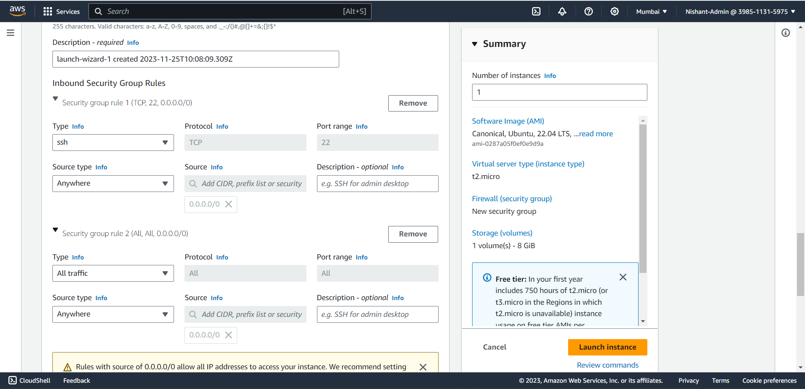
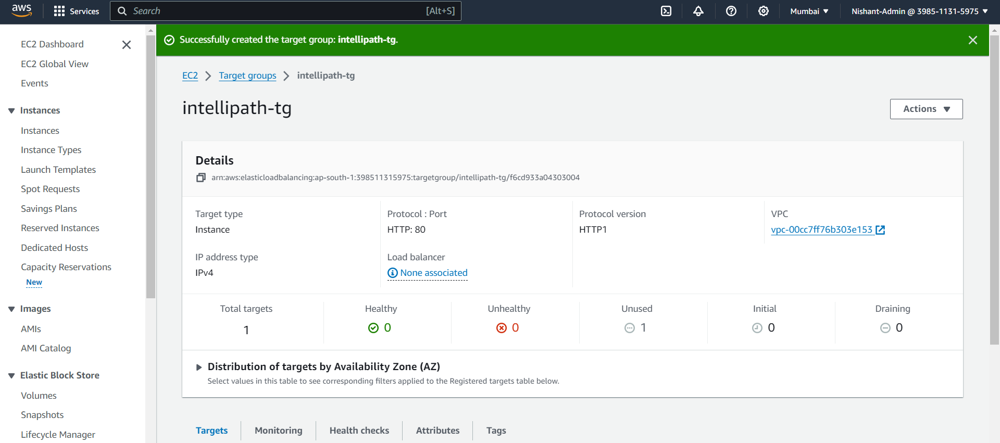
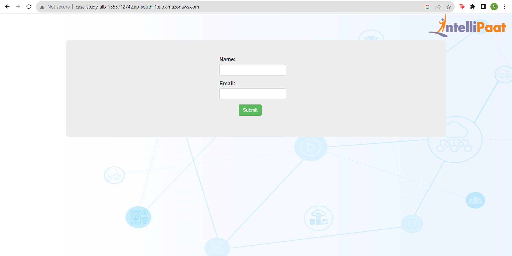

Name: Nishant Gupta

Email: ngofficial99@gmail.com

**[Description:]{.underline}**

Amazon Elastic Compute Cloud (Amazon EC2) provides scalable computing
capacity in the Amazon Web Services (AWS) cloud. Using Amazon EC2
eliminates your need to invest in hardware up front so you can develop
and deploy applications faster. You can use Amazon EC2 to launch as many
or as few virtual servers as you need, configure security and
networking, and manage storage. Amazon EC2 enables you to scale up or
down to handle changes in requirements or spikes in popularity, reducing
your need to forecast traffic.

**[Problem Statement:]{.underline}**\
Company ABC wants to move their product to AWS. They have the following
things set up right now:

1\. MySQL DB

2\. Website (PHP)

The company wants high availability on this product, therefore wants
Auto Scaling to be enabled on this website.

**[Steps To Solve:]{.underline}**

1\. Launch an EC2 Instance

2\. Enable Auto Scaling on these instances (minimum 2)

3\. Create an RDS Instance

4\. Create Database & Table in RDS instance:

a\. Database name: intel

b\. Table name: data

c\. Database password: intel123

5\. Change hostname in website

6\. Allow traffic from EC2 to RDS instance

7\. Allow all-traffic to EC2 instance

**[Solution:]{.underline}**

Step 1:

-   Login to your AWS management console and go to VPC.

{width="6.267716535433071in"
height="3.0in"}

-   Go to VPC and click on create VPC.

-   Give the VPC a name and select a CIDR a VPC.

{width="6.267716535433071in"
height="3.0416666666666665in"}

-   Click on create VPC

{width="6.267716535433071in"
height="3.013888888888889in"}

-   Now we need to create two subnets under this VPC so we will go under
    > the subnet sections.

{width="6.267716535433071in"
height="1.5833333333333333in"}

-   Click on create Subnet.

-   Select the VPC we just created.

{width="6.267716535433071in"
height="1.2361111111111112in"}

-   Enter the details of the subnet.

-   Create 2 subnets: one public and a private subnet.

{width="6.267716535433071in"
height="3.0in"}

{width="6.267716535433071in"
height="3.0416666666666665in"}

-   Click on create Subnet.

{width="6.267716535433071in"
height="1.1388888888888888in"}

-   Now we will turn the Public subnet which we have just created into a
    > public subnet.

-   Select the public subnet and click on actions, click on select
    > subnet settings.

{width="6.267716535433071in"
height="1.7083333333333333in"}

-   Click on Enable auto-assign public IP settings.

-   Scroll down and click on save.

{width="6.267716535433071in"
height="0.4166666666666667in"}

-   Now we will create our Internet Gateway.

-   Go under the internet-gateway option.

{width="6.267716535433071in"
height="1.2222222222222223in"}

-   Click on create internet gateway.

{width="6.267716535433071in"
height="2.75in"}

-   Click on create Internet Gateway.

{width="6.267716535433071in"
height="2.2777777777777777in"}

-   Click on Attach to VPC option on the top.

-   Select the VPC we have just created.

{width="6.267716535433071in"
height="1.8472222222222223in"}

-   Click on Attach Internet gateway.

{width="6.267716535433071in"
height="2.1527777777777777in"}

-   Now we will create a Route Table for our VPC.

-   Go to Route table.

-   Select the Route for the VPC we have created.

{width="6.267716535433071in"
height="2.736111111111111in"}

-   Click on Edit Routes .

{width="6.267716535433071in"
height="2.5833333333333335in"}

-   Add a Route which makes our Internet gateway publicly available.

{width="6.267716535433071in"
height="1.4583333333333333in"}

-   Click on Save changes.

{width="6.267716535433071in"
height="1.3888888888888888in"}

-   Click on Subnet association, Edit the subnet and add the public
    > subnet.

{width="6.267716535433071in"
height="2.7777777777777777in"}

-   Click on save associations.

-   Once our VPC is ready we will start creating our Instances.

-   We will launch the public-instance and we will click on
    > launch-instance.

{width="6.267716535433071in"
height="2.9722222222222223in"}

-   Adding a name to the instance, choose 'ubuntu as the AMi, choose
    > t2.micro as the instance type, in the network config we are choose
    > the VPC we just created, the public subnet and gave the security
    > group a rule that allows all traffic from anywhere ipv4.

{width="6.267716535433071in"
height="3.0in"}

{width="6.267716535433071in"
height="3.0277777777777777in"}

-   Click on Launch instance.

{width="6.267716535433071in"
height="1.9583333333333333in"}

-   Now we will connect to the instance that we have just created,

-   Open the instance and click on connect.

{width="6.267716535433071in"
height="2.9722222222222223in"}

-   Click on connect once again and we will be logged inside the
    > instance.

{width="6.267716535433071in"
height="2.986111111111111in"}

-   Update the instance by running \`sudo apt update\`.

{width="6.267716535433071in"
height="3.013888888888889in"}

-   Now we will install the web server Apache2 in this instance, to do
    > that we need to run \`sudo apt install apache2\`.

{width="6.267716535433071in"
height="2.9166666666666665in"}

-   Now we will just check if the service is running by copying the
    > public ip address of this instance and running it in your browser.

{width="6.267716535433071in"
height="3.1944444444444446in"}

-   Now we need to deploy the PHP code that was a part of this project.

{width="6.267716535433071in"
height="2.486111111111111in"}

-   So we will copy the download link
    > https://livelmsip.s3.amazonaws.com/mediaFiles/2023/07/27131156/drive-download-20230727T072846Z-001.zip

-   And run the command sudo wget
    > [[https://livelmsip.s3.amazonaws.com/mediaFiles/2023/07/27131156/drive-download-20230727T072846Z-001.zip]{.underline}](https://livelmsip.s3.amazonaws.com/mediaFiles/2023/07/27131156/drive-download-20230727T072846Z-001.zip)

-   This will download the code into our VM.

{width="6.267716535433071in"
height="1.4583333333333333in"}

-   Now we will install unzip into the vm so we can unzip the package.

-   Run command \`sudo apt install unzip\`.

{width="6.267716535433071in"
height="3.013888888888889in"}

-   Now lets unzip the file to do that run \`unzip
    > drive-download-20230727T072846Z-001.zip\`

{width="6.267716535433071in"
height="0.7083333333333334in"}

-   Now we will unzip the code.zip file.

{width="6.267716535433071in"
height="0.8611111111111112in"}

-   Go inside the 1243 folder and you will find the index.php

-   Now we will replace the default index file for the apache server
    > with this pho file.

{width="6.267716535433071in"
height="1.7638888888888888in"}

-   Go inside the 1243 directory and run the mv command.

{width="6.267716535433071in"
height="0.5138888888888888in"}

-   Now we will go back to the default var/www/html location and remove
    > the index.html file.

{width="6.267716535433071in"
height="1.7083333333333333in"}

-   Now we can go to the public ip of the ec2 instance and check .

{width="6.267716535433071in"
height="2.888888888888889in"}

-   We have successfully deployed the webserver with the php web app
    > running.

-   Now that the front-end of the application is up and running we need
    > our database to be in place.

-   We can go to RDS and create a database for our application.

{width="6.267716535433071in"
height="3.013888888888889in"}

-   Click on create DB instance and configure the instance.

-   Go with standard create mysql instance.

{width="6.267716535433071in"
height="3.0555555555555554in"}

-   Choose the free tier as the template.

-   Provide the instance with a name, user and password.

{width="6.267716535433071in"
height="3.0277777777777777in"}

-   In the network config we will select the VPC that we have created
    > previously.

-   Also disable autoscaling.

{width="6.267716535433071in"
height="2.9722222222222223in"}

-   Give the initial database name as intel.

{width="6.267716535433071in"
height="2.986111111111111in"}

-   We will also disable encryption and monitoring.

-   Create the database

{width="6.267716535433071in"
height="2.6944444444444446in"}

-   Wait for the instance to be created.

{width="6.267716535433071in"
height="3.0277777777777777in"}

-   Once the instance is up and ready, copy the endpoint of the instance
    > so we can update the code in the index.php.

-   Go back to the instance and open the index.php using the nano text
    > editor.

{width="6.267716535433071in"
height="0.8888888888888888in"}

-   Update the endpoint, username and the password.

{width="6.267716535433071in"
height="0.9027777777777778in"}

-   Save and exit the file.

-   We can cat the file to check if the file has been updated and saved
    > successfully.

{width="6.267716535433071in"
height="0.7916666666666666in"}

-   Now we will add the php repository to add that we will run the
    > command

-   \`sudo apt-add-repository -y ppa:ondrej/php\`

{width="6.267716535433071in"
height="1.0972222222222223in"}

-   Once the php repo has been installed we will also install the mysql,
    > php and php-mysql.

-   To do that we will run the command \` sudo apt install php5.6
    > mysql-server php5.6-mysqli\`

{width="6.267716535433071in"
height="2.0833333333333335in"}

-   Now once we have added the packages we can go back to the web page
    > and refresh and now the mysql errors will be gone.

{width="6.267716535433071in"
height="3.2222222222222223in"}

-   We have successfully deployed the application and connected it to
    > the webpage.

-   Now we need to create the table for the data coming from the
    > application to be stored in.

-   We will go back to the instance and connect to the database first.

-   Run \`mysql -h
    > database-intellipath.c6mqurugasdk.ap-south-1.rds.amazonaws.com -u
    > admin -p \`

{width="6.267716535433071in"
height="1.8888888888888888in"}

-   We have already created the database intel to confirm that we can
    > run \`show databases\` command.

{width="6.267716535433071in"
height="2.611111111111111in"}

-   We will use the intel database and create the table inside.

{width="4.104166666666667in"
height="1.03125in"}

-   We will run the command \`create table data(firstname
    > varchar(20),email varchar(20));\`

{width="6.267716535433071in"
height="1.5in"}

-   Now once we have created the table lets go to the webserver and try
    > to save data and check if we are getting that data in our
    > database.

{width="6.267716535433071in"
height="2.6527777777777777in"}

{width="6.267716535433071in"
height="2.875in"}

-   It says a new record was created successfully so we will confirm
    > that by running the select command in the db.

{width="6.267716535433071in"
height="2.4722222222222223in"}

-   So we have successfully made the data transfer.

-   Now we will create a load balancer which will help us with routing
    > the instance also handling load.

-   Go back to the ec2 dashboard and click on load balancers.

{width="6.267716535433071in"
height="2.5972222222222223in"}

-   Click on create load balancer.

-   Choose Application load balancer and click on next.

-   Give the ALB a name and choose our VPC.

{width="6.267716535433071in"
height="3.0277777777777777in"}

-   Select both the AZ's and and the security groups.

{width="6.267716535433071in"
height="3.013888888888889in"}

-   Now we will create a target group, click on create target group.

{width="6.267716535433071in"
height="3.0277777777777777in"}

-   Give the target group a name and select our VPC and click on next.

{width="6.267716535433071in"
height="3.013888888888889in"}

-   Select the instance.

{width="6.267716535433071in"
height="2.75in"}

-   Click on include as pending below and click on create target group.

{width="6.267716535433071in"
height="1.5833333333333333in"}

{width="6.267716535433071in"
height="2.7777777777777777in"}

-   Once the target group has been created we can go back to the
    > application load balancer and refresh the target group column and
    > select the target group we have just created

{width="6.267716535433071in"
height="1.7777777777777777in"}

-   Now we can just create the load balancer.

{width="6.267716535433071in"
height="1.8194444444444444in"}

{width="6.267716535433071in"
height="1.6944444444444444in"}

-   Now we should be able to access the website using the dns of the
    > load balancer so we will copy the DNS of the load balancer and
    > check if we are able to access the website.

{width="6.267716535433071in"
height="3.138888888888889in"}

-   And we have successfully attached the load balancer.

-   Finally we will enable auto scaling for my instance with a maximum
    > of 2 instances so we will go to auto scaling groups.

{width="6.267716535433071in"
height="2.875in"}

-   Click on create Auto scaling group.

-   Give the group a name.

{width="6.267716535433071in"
height="3.0277777777777777in"}

-   Click on create a launch template.

{width="6.267716535433071in"
height="2.9722222222222223in"}

-   Use our instance configuration.

{width="6.267716535433071in"
height="3.0416666666666665in"}

-   Click on create launch template.

{width="6.267716535433071in"
height="0.875in"}

-   Select the launch template.

{width="6.267716535433071in"
height="3.0in"}

-   Click on next.

-   Specify the instance attributes.

{width="6.267716535433071in"
height="3.0277777777777777in"}

-   Select our network configuration

{width="6.267716535433071in"
height="3.013888888888889in"}

-   Click on next.

-   Attach our load balancer,

{width="6.267716535433071in"
height="2.9444444444444446in"}

-   Click on next.

-   Choose desired size to be 1 with maxim to be 2 instances.

{width="6.267716535433071in"
height="3.0555555555555554in"}

-   Click on skip to review and create our Auto scaling group.

{width="6.267716535433071in"
height="2.8333333333333335in"}

-   We have successfully attached the auto scaling policy hence
    > completing all the requirements for the capstone project 1.
